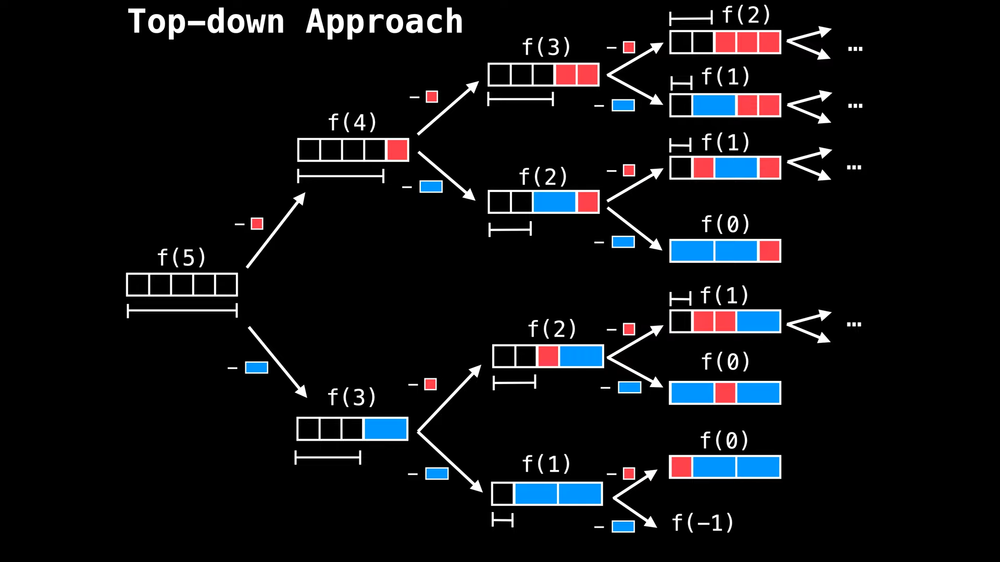
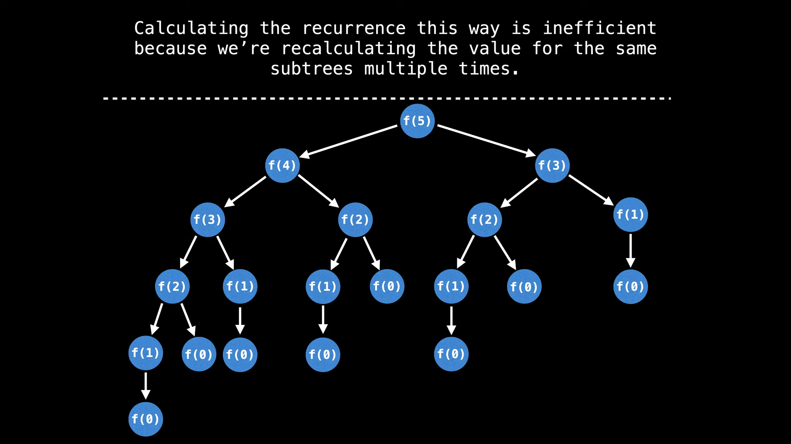
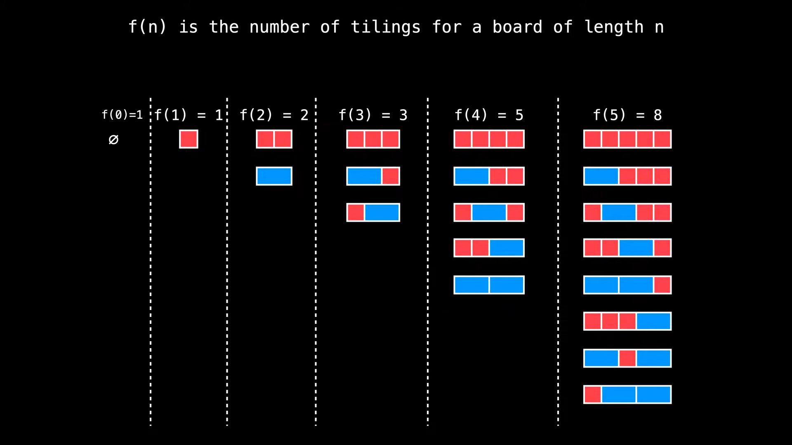

# 2. Tiling Problems [1 2]

## 2.1. Intro

- tiling problems are a certain class of dp problems, which involve counting the number of possible tiling on a board or a grid, given tiles of various shapes and sizes
- this type of problems are generally very intuitive and also themsevles nicely to be transformed into `straightforward recurrences`

## 2.2. Problem Statement


-- assume you have an infinite amount of red and blue blocks

## 2.2. Approach

- there are multiple ways of solving this problem. We are going to discuss only the **Top-down Approach** and the **Bottom-up Approach** which use dynamic programming

### 2.2.1. Top-down Approach

- assume we have a full board we need to fill and break it down by placing red and blue tiles. In the end we are going to know how many ways there are to tile the board by looking at how many full boards we have
- let $f(n)$ be the number of ways to tile a board of length $n$

- we start by placing a red tile or a blue tile on the left most position of the board like a decision tree and then we recurse on the remaining board



### 2.2.2. Recursive formula

- for each node we are going to try to place either a red block or a blue block
- placing a red block translates into solving $f(n-1)$
- placing a blue block translates into solving $f(n-2)$
- our base case is when we have a board of length 0, which means we have a full board and we return 1 which is $f(0) = 1$
- recursion work depth first, so we are going to start on the left and explore all the way down to the base case and then we are going to backtrack and explore the right side of the tree

### 2.2.3. Code

Time Complexity: $O(2^n)$

```python
def f(n):
    if n < 0:
        return 1
    if n == 0:
        return 1
    return f(n-1) + f(n-2)
```



- the algorithm is exponential because it divides each state into two nodes
- that was the brute force approach, now let's see how we can optimize it using dynamic programming

- this is actually very simillar to the fibonacci problem

### 2.2.4. Optimization

- Implementing a memory cache would prevent repeated calculations

Time Complexity: $O(n)$
Space Complexity: $O(n)$

```python
# recursive approach with cache
def f(n, cache):
    if n < 0:
        return 0
    if n == 0:
        return 1
    if n in cache:
        return cache[n]
    cache[n] = f(n-1, cache) + f(n-2, cache)
    return cache[n]
```

- with this caching mechanism we have eliminated the exponential branching factor and we have reduced the time complexity to $O(n)$

### 2.2.5. Bottom-up Approach

- another way to solve this problem is to start from the base case and build our way up to the solution



```python
def i(n):

    if n == 0 or n == 1:
        return 1

    cache = [0] * (n+1)
    cache[0] = 1
    cache[1] = 1
    for i in range(2, n+1):
        cache[i] = cache[i-1] + cache[i-2]
    return cache[n]
```
 