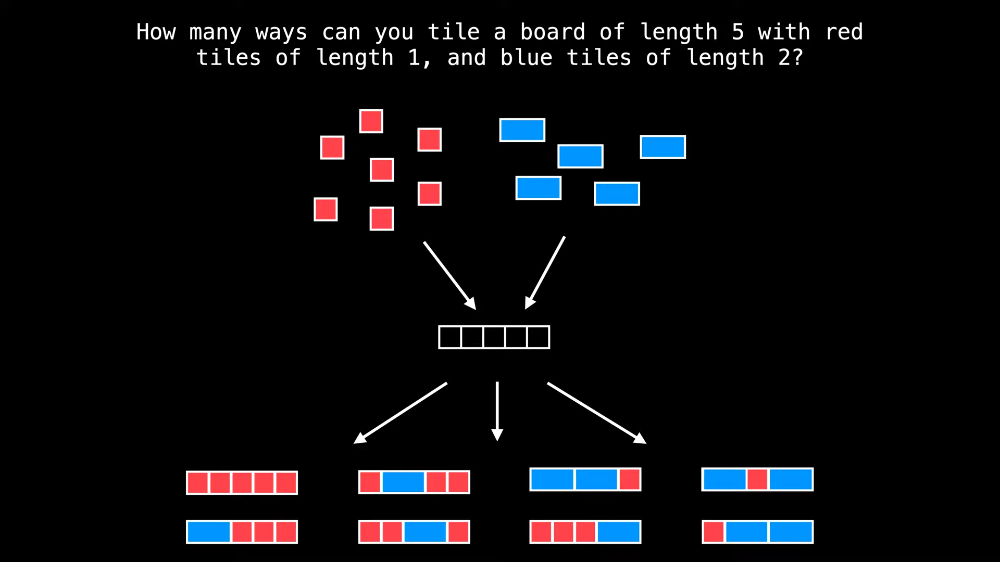

# 2. Tiling Problems [1 2]

## 2.1. Intro

- tiling problems are a certain class of dp problems, which involve counting the number of possible tiling on a board or a grid, given tiles of various shapes and sizes
- this type of problems are generally very intuitive and also themsevles nicely to be transformed into straightforward recurrences

## 2.2. Problem Statement

-- assume you have an infinite amount of red and blue blocks

## 2.2. Approach

- there are multiple ways of solving this problem. We are going to discuss only the **Top-down Approach** and the **Bottom-up Approach** which use dynamic programming
