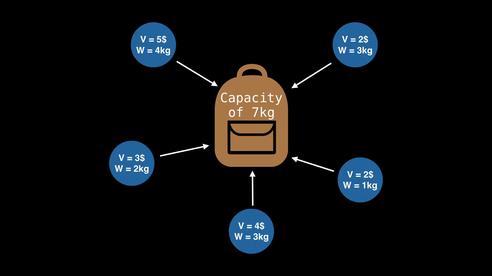
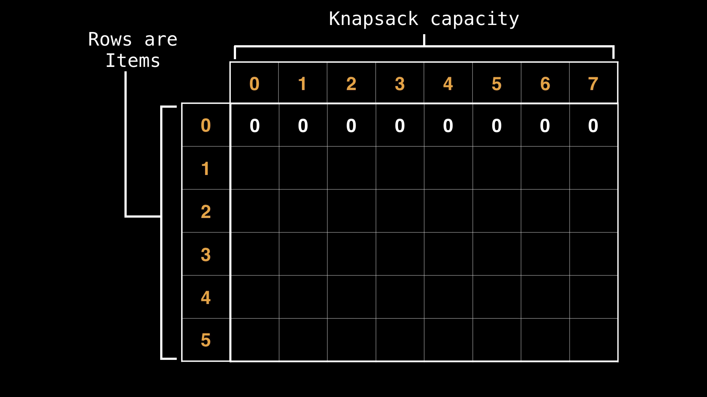

# 8. 0 1 Knapsack problem

[video](https://www.youtube.com/)
[try it](https://practice.geeksforgeeks.org/problems/0-1-knapsack-problem0945/1)

## 8.1. Intro

- Knapsack problem is a cool problem in computer science
- In particular, we are going to talk about the 0/1 knapsack problem
- It's a very popular problem that arises everywhere in computer science
- It's important to know how to sove it
- the decision version of the knapsack problem is np-complete but we can achieve pseudo polynomial time with dynamic programming.

## 8.2. Problem Statement

Given a set of objects which have both a value and a weight $(Vi, Wi)$ what is the `maximum value` we can obtain by selecting a subset of these objects such that the sum of the weights does not exceed a certain capacity (i.e the knapsack capacity)?



## 8.3. DP Approach

- the first thing we will need is a table of values, to store various states



- in the context of the knapsack problem we can think of a raw in this table as representing individual items, and the columns as representing various capacities or maximum capacities our knapsack can have

- we are going to solve the problem by considering the first item then figuring out all the best possible values we can achieve for each capacity, and after that considering the second item and reusing information we know from the first item to formulate a combined best value for those two items, and then incorporating a third and a fourth item and etc.
- what we want to do for each column in the current row is to figure out if we should or should not include the current item, if we don't include the current item, then we look one row above. but if we do include the current item we still look one row above but shifted over by the weight of the current item, because that would be the sate with the best possible value, and the knapsack is large enough to hold our item.

### How to fill the table?

```text
    there is a confusion in the video on what is the purpose of the blue (long) arrow
```


### we now know the best value we can achieve (on the bottom right corner of the table), but which items do we actually need to select?

- the idea is going to be to start at the bottom right corner and work backwards, we include an element if the current value and the value in the row above it differ. the idea being that if the 2 values differ, then the row we are currently on must have had its item included. otherwise, the value would not have changed.
- when we decide to include a row item, we need to substract its weight, so that we can consider a smaller knapsack size. then we shift our focus to the row above in the correct column and repeat the process.
- if the value in the current row is the same as the value in the row above it, then we know that the current item was not included, so we don't need to do anything and we just move up one row.
- the base case is when we reach the top row, in which case we are done, or when we reach a cell of value 0.

## code

```python
    def knapsack(c, w, v):
    """
        c: capacity of the knapsack
        w: the weight of the items
        v: the value of the items
    """
    n = len(w)
    dp = [[0 for _ in range(c + 1)] for _ in range(n + 1)]

    for i in range(1, n + 1):
        for j in range(1, c + 1):
            
            # get the the value and weight of the item
            w, v = w[i - 1], v[i - 1]

            # for each knapsack size
            for j in range(1, c + 1):
                
                # consider not picking this element
                # intially set that as the best current value
                dp[i][j] = dp[i - 1][j]
                # then we check if we can update to a better value by including the current item
                if j >= w and dp[i - 1][j - w] + v > dp[i][j]:
                    dp[i][j] = dp[i - 1][j - w] + v

        ######################################
        # checking what items are selected
        items = []
        sz = c
        for i in range(n, 0, -1):
            if dp[i][sz] != dp[i - 1][sz]:
                items.append(i)
                sz -= w[i - 1]
        
        # put the items in the natural order
        items.reverse()

        return dp[n][c], items
```

## more resources

- [
CS Dojo video
](https://youtu.be/xOlhR_2QCXY?si=Utu58e3E0yYLNBWk)
