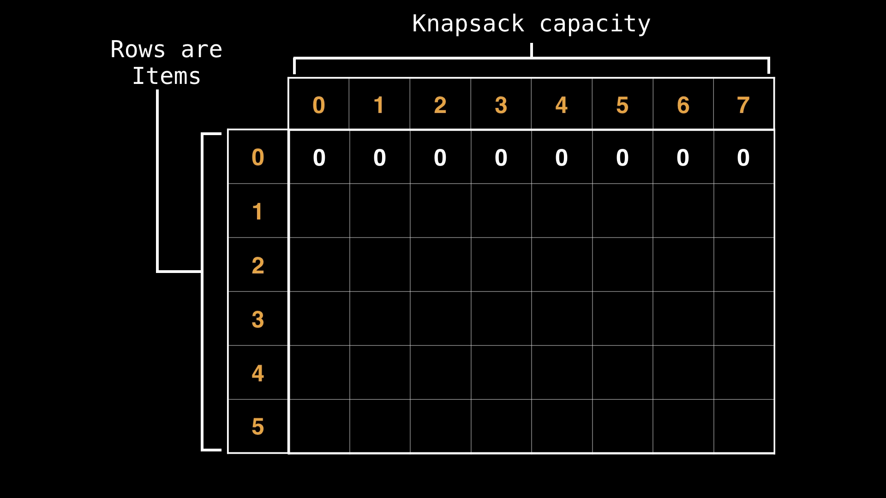

# 8. 0 1 Knapsack problem

[video](https://www.youtube.com/)

## 8.1. Intro

- Knapsack problem is a cool problem in computer science
- In particular, we are going to talk about the 0/1 knapsack problem
- It's a very popular problem that arises everywhere in computer science
- It's important to know how to sove it
- the decision version of the knapsack problem is np-complete but we can achieve pseudo polynomial time with dynamic programming.

## 8.2. Problem Statement

Given a set of objects which have both a value and a weight $(Vi, Wi)$ what is the `maximum value` we can obtain by selecting a subset of these objects such that the sum of the weights does not exceed a certain capacity (i.e the knapsack capacity)?

## 8.3. DP Approach

- the first thing we will need is a table of values, to store various states

- in the context of the knapsack problem we can think of a raw in this table as representing individual items, and the columns as representing various capacities or maximum capacities our knapsack can have
- we are going to solve the problem by considering the first item then figuring out all the best possible values we can achieve for each capacity, and after that considering the second item and reusing information we know from the first item to formulate a combined best value for those two items, and then incorporating a third and a fourth item and etc.
- what we want to do for each column in the current row is to figure out 