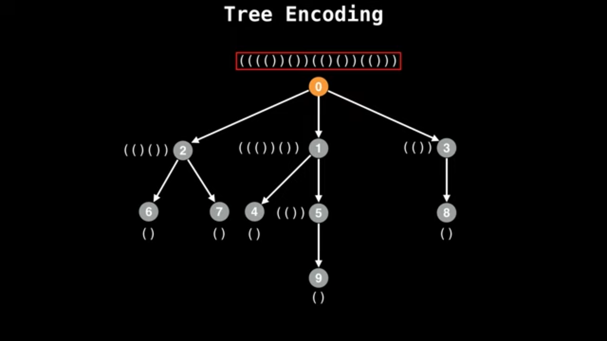

# 5. Identifying Isomorphic Trees

[video](https://youtu.be/OCKvEMF0Xac?si=s0on1BY1KifFTNel)

## 5.1. Intro

- Isomorphisms with trees.
- a question of tree equality and what that means?

## 5.2. Graph Isomorphism

- when we are talking about general graphs ans ask the question whether two graphs $G1$ and $G2$ are `isomorphic` is asking whether they are structurally the same.
- if we define a graph $G1$ as the set of edges $E1$ and the vertices $V1$ => $G1(V1, E1)$ and another graph $G2(V2, E2)$ in the same manner
- we say that the two graphs $G1 and $G2$ are isomophic if there exists a `bijection` (symbol) between the sets of vertices $V1$ and $V2$ such that:
  - for all the pairs of vertices which form an edge in $G1$ applying the function `fai` to the nodes of all those edges always results in an edge which is present in $G2$

    `equation`
    - `$all u, v belongs to V1, (u,v) belongs to E1$ =>`

- in simple terms, for an isomorphism to exist there needs to be a function `fai` which can map all the `nodes/edges` in $G1$ to $G2$ and vice-versa.

<i>as it turns out..</i>

- Determining if two graphs are isomorphic is not only obvious to the human eye, but also a difficult problem for computers.
- it's still an open question as to whether the graph isomorphism problem is NP complete. 

<i>np complete means...</i>

- However, many polynomial time isomorphism algorithms exist for a specialized graph types such as trees.

## 5.3. Identifying Isomorphic Trees

<i>in terms of writing an algorithm for identifying isomorphic trees..</i>

- There are several very quick `probabilistic` (usually hash or heuristic based) algorithms for identifying ismorphic trees.
- These tend to be fast, but also error prone due to hash collisions in a limited integer space. they can be helpful in competitive programming and testing the equality of enormous trees.
- we are going to discuss a method involves `serialiing` a tree into a `unique encoding`.
- This unique encoding is simply a unique string that represents a tree, if another tree has the same encoding then they are isomorphic.

## 5.4. encoding A Tree

- when are going about encoding a tree, you can either directly serialize an unrooted tree, but in practice serializing a rooted tree is typically easier code wise
- however, one caveat to watch out for if to check if they're isomorphic (rooted approach) is to ensure that the same root node is selected in both trees before `serializing/encoding` the trees. otherwise, you get 2 different encodings
- select a common node between both trees. we can use what we learned from [finding the center(s) of a tree](../4.%20Tree%20center(s)/README.md) to help ourselves.

## 5.5. The Algorithm

> given 2 trees which may or may not be isomorphic
> find the center(s) of the both trees
> root the trees at their center nodes
> generate the encoding for each tree
> compare the serialized tree values for equality
-- the tree encoding is a sequence of `(` and `)`, however you can also think of them as zeroes and ones
-- from this encoding it's also possible to reconstruct the original tree. `Exercice`

## 5.5. The AHU Algorithm

## 5.5.1. Intro

- It's a celver serialization technique for representing a tree as a unique string.
- unlike many tree isomorphism invariants and heuristics, AHU is able to capture `complete history` of a tree's `degree spectrum` and a structure ensuring a deterministic method of checking for a tree isomorphisms.

## 5.5.2. Steps

> assign all leaf nodes Knuth tuples; `()`
> every time you move up a layer the labels of the previous subtrees get sorted lexicographically and wrapped in brackets
> you cannot process a node until you have processed all its children



## 5.5.3. Code

```python
  # class difinition

  class TreeNode

  # Returns whether two trees are isomorphic
  # parameters tree1 and tree2 are undirected trees
  # sorted as adjacency lists

  def isIsomorphic(t1, t2):

    t1Centers = treeCenters(t1)
    t2Centers = treeCenters(t2)

    t1Rooted = rootTree(t1, t1Centers[0])

    for center in tree2Centers:

      t2Rooted = rootTree(t2, center)
      t2Encoded = encode(t2Rooted)

      if t1Encoded == t2Encoded:
        return True

      return False

  def encode(n: TreeNode):

    if not n:
        return ""
    
    code = []

    for c in n.children:
        code.append(encode(c))

    code.sort()

    serial = ""

    for c in code:
        serial += c
    

    
    return "(" + serial + ")"
```
